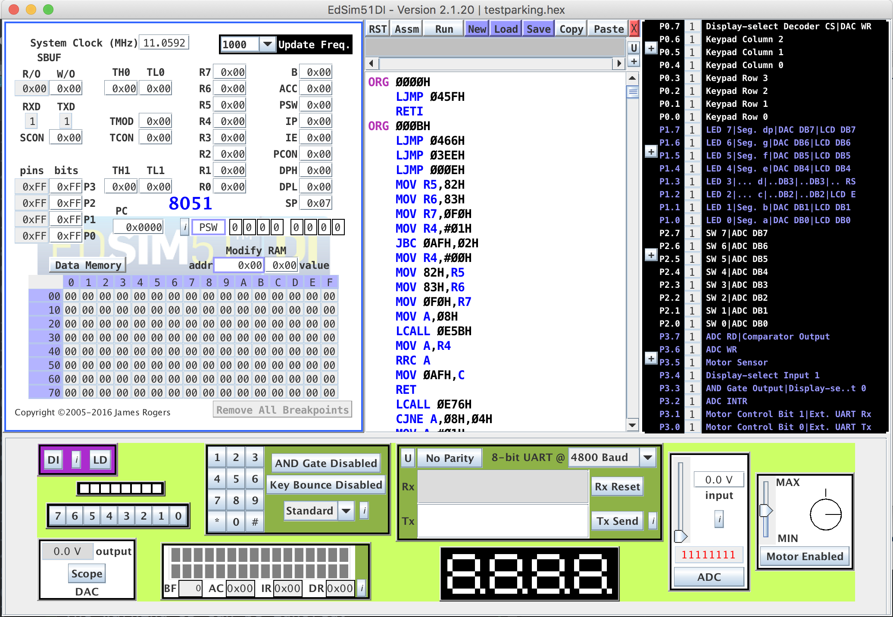

# Fall-2020-Operating-Systems

Implementation of a multi-threading package in C language and some test-cases.

## Requirements

You need Edsim51 to simulate 8051 processor and SDCC to generate Edsim51-targeted files.

- Edsim51
    - From http://edsim51.com/
    - Runs as a Java app
    - DI version simulates a complete embedded system
    - LCD, LEDs, keypad, bank of buttons, ADC, DAC
    - cycle-accurate processor

- SDCC for Edsim51
    - From http://sdcc.sourceforge.net/
    - SDCC: Small Device C Compiler
    - Open source, free, cross-platform

## Contents

ppc stands for _programming project checkpoint_.

- ppc 1: cooperative thread-switching
- ppc 2: preemptive thread-switching
- ppc 3: semaphore + bounded-buffer example
- ppc 4: two producers and one consumer example
- ppc 5: delay function + parking lot example

Each ppc is based on the previous one.

## Usage

1. In each ppc directory, use `make` command to generate `.hex` file.

    

    The warning 85 can be ignored.

2. Click _Load_ in Edsim51 simulator and select the generated `.hex` file.

    

3. Click _Assm_.

    

4. Now you can click _Run_ to execute or _Step_ to execute by one step.

    You can modify the _Update Freq._ to change the execution speed.

5. If you modify the source code, then you need to use `make clean` to remove old `.hex` file and re-generate.

    

## Contact

Feel free to email me at [khchen.me@gmail.com](mailto:khchen.me@gmail.com) or open an issue here if you have any ideas.
